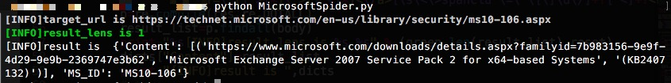

# microsoftSpider
爬取微软漏洞信息，MS对应的每个版本操作系统KB号以及补丁下载地址。

### 项目文件
* MicrosoftSpider.py 爬虫代码
* oprethinkdb.py 数据库代码
* ms_kb.db 最终数据库文件（JSON格式）

### ms_kb.db
此数据库文件包含了2010-2017年所有的MS漏洞信息，包括MS编号，对应的操作系统版本，以及KB号和补丁下载地址，可直接下载使用。

数据格式为json，每行以\n结尾。
#### python中转化
```bash
with open("ms_kb.txt","r") as w:
    f=[i.strip("\n") for i in w.readlines()]
for i in f:
    print type(json.loads(i))
```
输出的结果是一个字典文件，包含字段：
* MS_ID
* id
* Content 

Content为一个列表，格式如：[(补丁url,操作系统版本，K对应的B号),]

### MicrosoftSpider.py
如果想要获取更多信息，可以修改爬虫代码，自行爬取。
#### Usage
```bash
python MicrosoftSpider.py
```
运行程序会输出相应MS对应的信息


注意：在运行前请先修改代码填写要爬取年份ms漏洞的url。
如：

每一年的ms信息都对应一个url。

### oprethinkdb.py
我已注释数据库相关代码，如需对爬取的数据进行存储，可自行添加代码。

@By nMask
@Date 20170516


